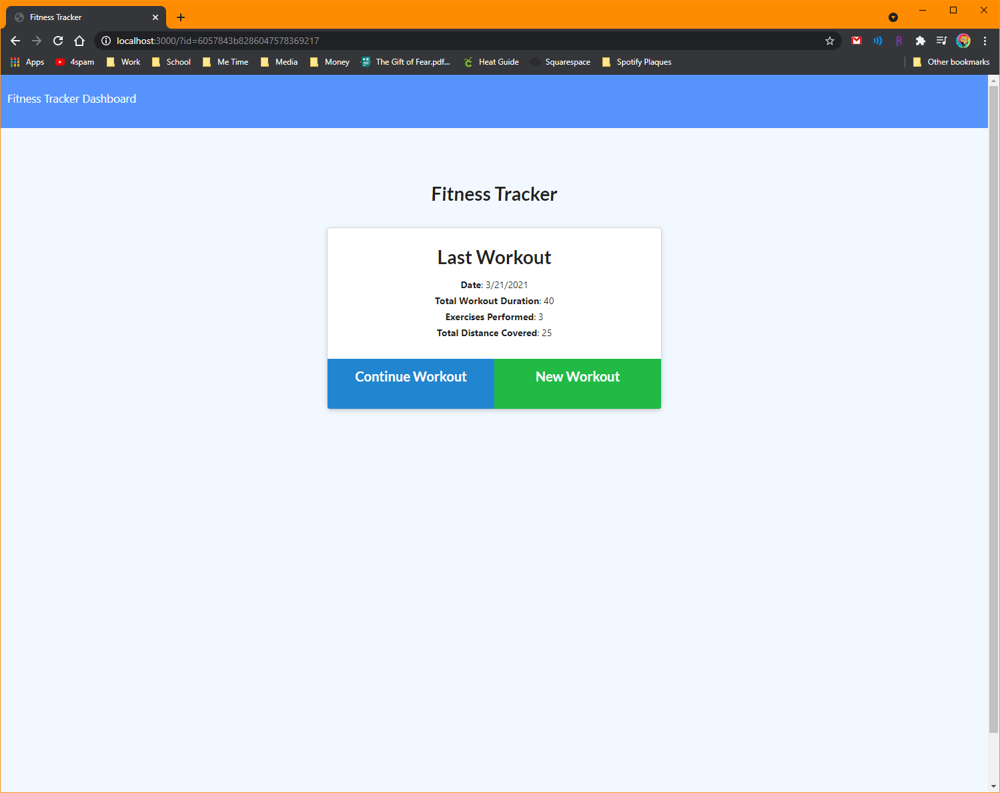
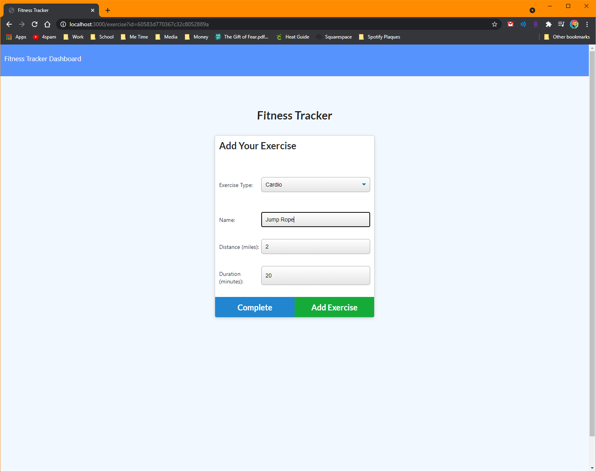
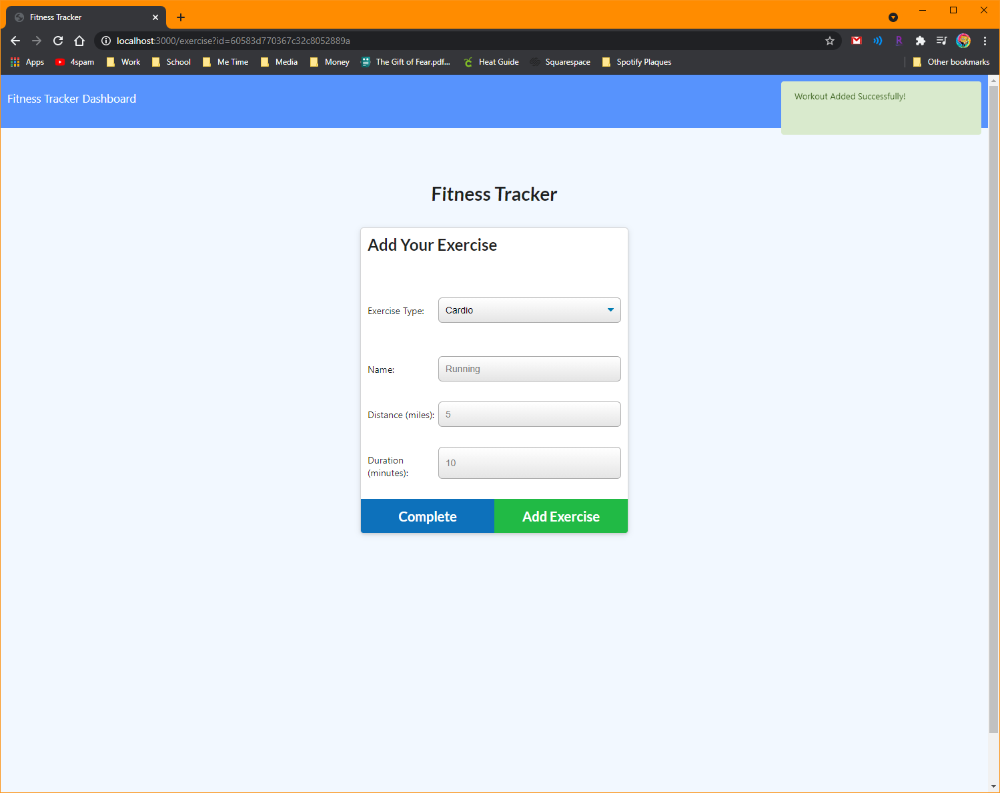
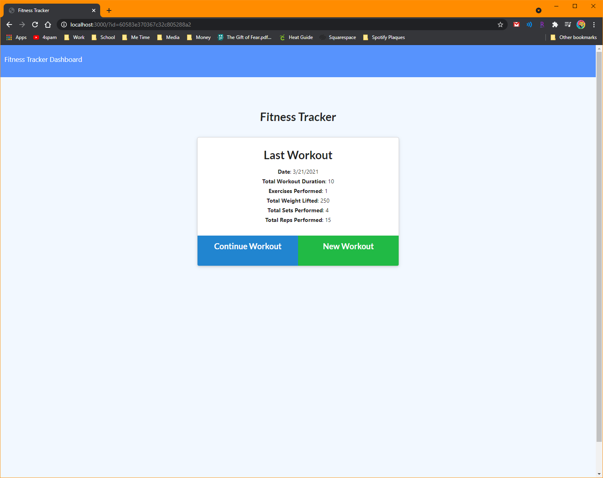
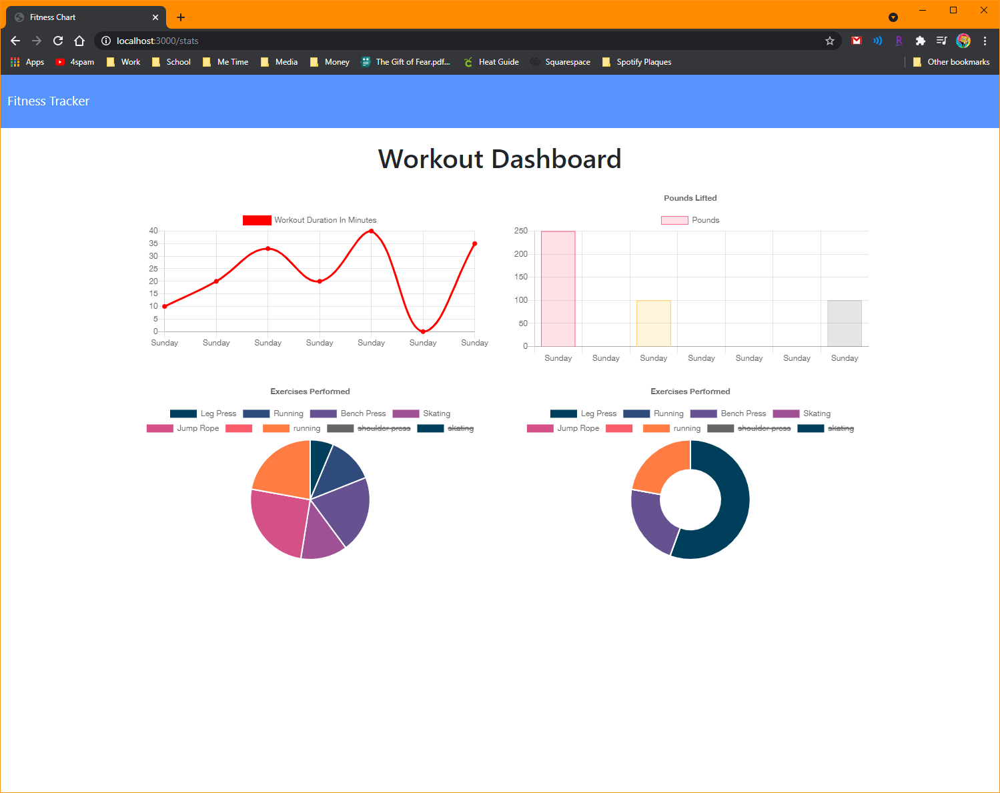

# fitTrack
## *Track your Fitness!*
**Technologies used: Javascript, Mongoose, MongoDB, Heroku, MongoDB Atlas**

------------

Link to my deployed application : <a href="https://limitless-shore-41269.herokuapp.com/">Here</a>

------------

FitTrack is an application that tracks your different work outs. Input either a Cardio or Resistance workout, fill in the necessary information, and either complete a workout all at once, or pick up where you left off with the 'Continue Workout' button. After a week of workouts, the dashboard is filled with bar graphs, pie charts, and all the necessary data to let you know how much you've exercised. 

MongoDB is great! I prefer it so much more than MySQL and makes databases so much easier to understand and establish. 

I struggled a little bit with the routing, as API calls are still not my strong suit, but I'm definitely getting better. I have a great tutor, and a great study group that really focuses on making sure I understand the concept instead of zeroing in on whether or not the assignment is done. 

Thankfully, much of this assignment was boiler plate, which again, allows me to focus on the concept. Aside from having less trouble setting up my API routes, the schema was also easier to set up thanks to the schema-less format that Mongoose allows you to operate in. 

As I previously mentioned, my tutor is amazing, and thanks to her help, I was able to find some errors in the provided code. There was a line that needed to be an arrow function, and once we implemented that fix, the entire app was up and running. 

Because I just deployed today, there is only 1 workout for 1 day, and the rest display as undefined. 

------------

Link to my deployed application : https://limitless-shore-41269.herokuapp.com/

